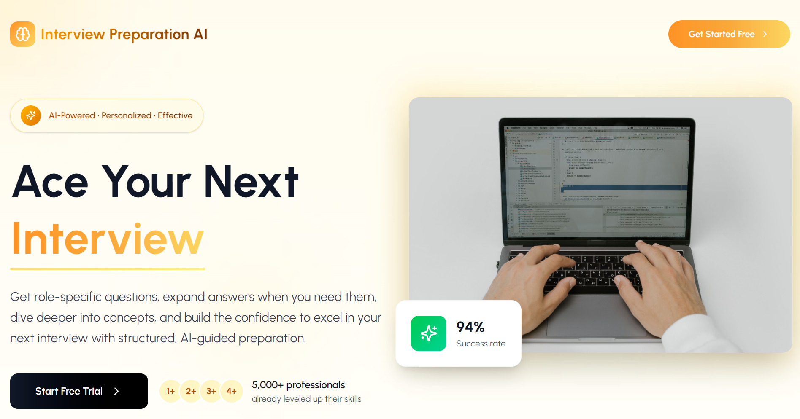
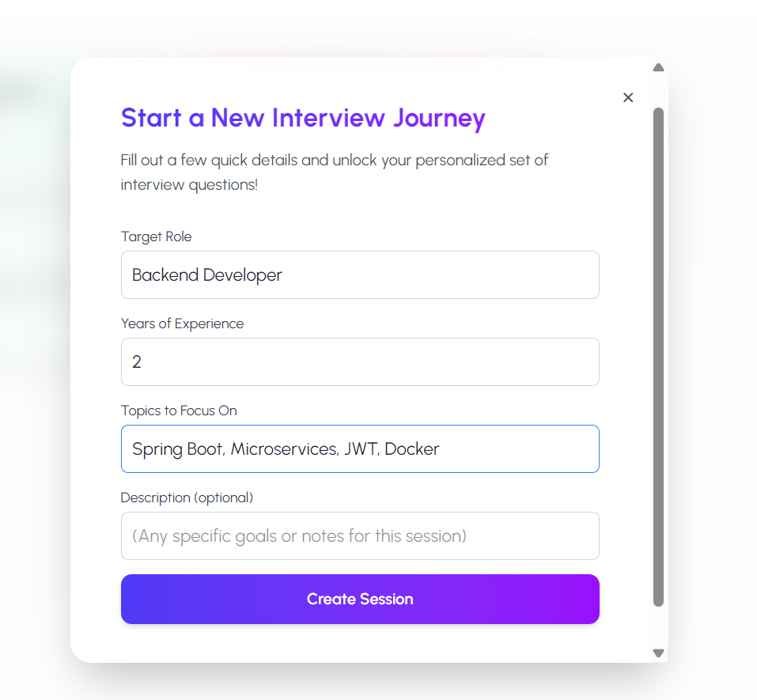
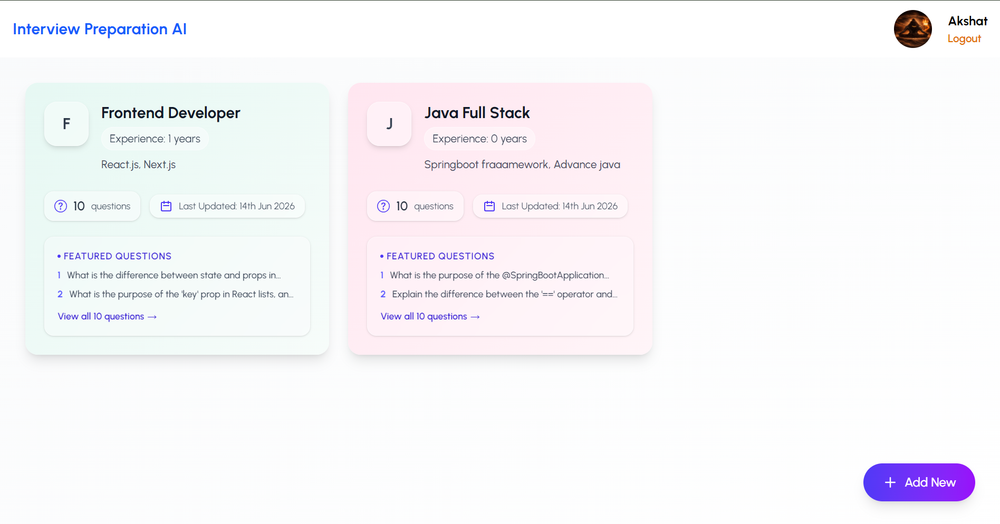
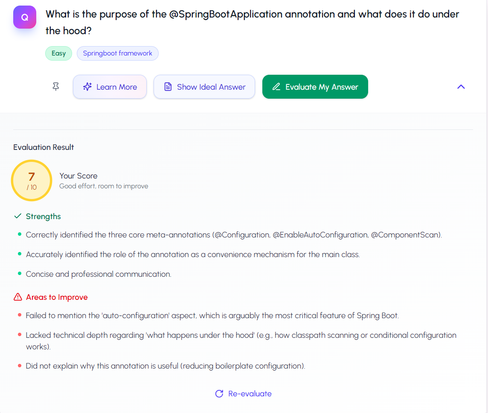
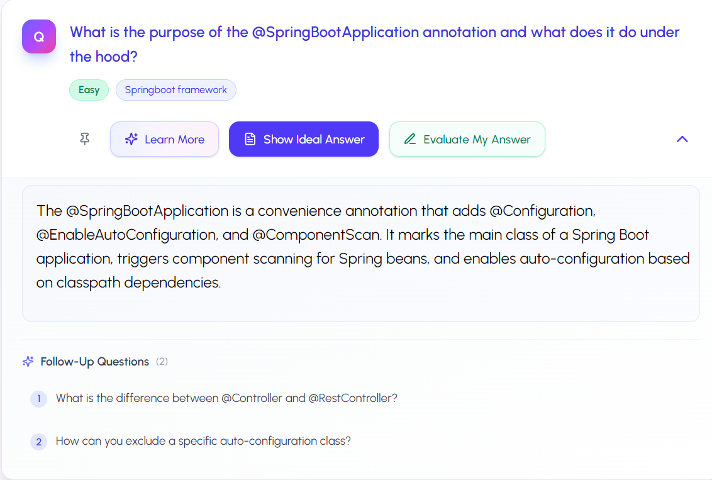
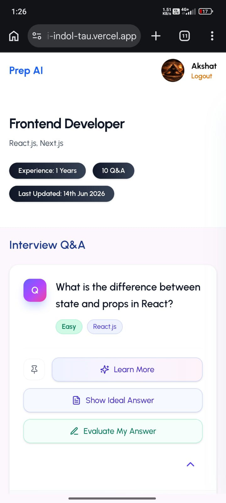

# Interview Preparation AI

[](https://reactjs.org/)
[](https://vitejs.dev/)
[](https://tailwindcss.com/)
[](https://nodejs.org/)
[](https://expressjs.com/)
[](https://www.mongodb.com/cloud/atlas)
[](https://ai.google.dev/)
[](https://cloudinary.com/)
[](https://vercel.com/)
[](https://render.com/)

**Interview Preparation AI** is a production-ready, full-stack application designed to help candidates conquer their next technical and behavioral interviews. Powered by the **Google Gemini API**, the platform acts as an intelligent mock interviewer, creating customized sets of questions tailored to specific roles, experience levels, and topics. It evaluates user answers, scores them out of 10, provides constructive feedback highlighting strengths and improvement areas, and generates dynamic follow-up questions to simulate a real, live conversational interview flow.

---

## Project Highlights

* 🚀 Full Stack MERN Application
* 🤖 Google Gemini AI Integration
* 🔐 JWT Authentication
* ☁️ Cloudinary Image Uploads
* 📱 Fully Responsive Mobile Design
* 🌍 Deployed on Vercel + Render

---

## Live Demo

* **Frontend (Vercel):** [https://interview-prep-ai-indol-tau.vercel.app/](https://interview-prep-ai-indol-tau.vercel.app/)
* **Backend (Render):** [https://interview-prep-ai-backend-nmr1.onrender.com](https://interview-prep-ai-backend-nmr1.onrender.com)

---

## Features

* 🧠 **AI-Generated Interview Questions:** Dynamically creates professional interview questions based on the candidate's target role, experience level, and preferred focus topics.
* 💡 **AI-Generated Ideal Answers:** Instantly reveals detailed, industry-standard reference answers ("Show Ideal Answer") for every generated question to accelerate learning.
* 📊 **AI Answer Evaluation:** Analyzes user-submitted answers using advanced semantic evaluation to award a score out of 10.
* 📝 **Strengths & Improvements Feedback:** Identifies key concepts correctly covered in the user's response and highlights structural or technical areas for growth.
* 🔍 **Deep-Dive Concept Explanations:** A "Learn More" module that dynamically generates secondary conceptual guides, code snippets, and explanations for complex questions.
* 💬 **Conversational Follow-Ups:** Generates context-aware follow-up questions derived from the primary answer to simulate realistic multi-turn interview interactions.
* 🔒 **JWT Authentication & Security:** Secure user registration and login flow utilizing JSON Web Tokens (JWT) for route guarding and session management.
* 📷 **Cloudinary Media Storage:** Direct integration with Cloudinary for uploading, storing, and serving user profile pictures.
* 📁 **Session History Management:** Allows users to save past interview preparations, track their performance, and delete older sessions.
* 📱 **Mobile-First Responsive Design:** Fully audited and optimized layout providing seamless interactivity across viewports down to 320px width.

---

## Screenshots

### Landing Page


### Create Interview Session


### Dashboard


### AI Evaluation


### Follow-Up Questions


### Mobile View


---

## System Architecture

The application is structured as a decoupled client-server architecture with secure API communication and third-party media and AI integrations:

```
User
  │
  ▼
[ React Frontend (Vite + Tailwind CSS) ]
  │  (Secured REST API Calls / JSON Web Tokens)
  ▼
[ Express Backend (Node.js) ]
  │
  ├─► [ MongoDB Atlas (Session & Question Persistence) ]
  │
  ├─► [ Cloudinary SDK (Direct Profile Photo Media Storage) ]
  │
  └─► [ Google Gemini AI API (Structured JSON Question & Eval Engine) ]
```

---

## Tech Stack

| Component | Technology | Description |
| :--- | :--- | :--- |
| **Frontend** | React.js (v18+) | Component-based interactive UI library |
| **Build Tool** | Vite | Ultra-fast next-generation frontend tooling |
| **Styling** | Tailwind CSS | Utility-first responsive CSS styling |
| **Backend** | Node.js / Express.js | Event-driven backend runtime and REST routing |
| **Database** | MongoDB Atlas | Cloud-hosted NoSQL database for document persistence |
| **ORM** | Mongoose | Elegant MongoDB object modeling for Node.js |
| **AI Integration** | Google Gemini API (`@google/generative-ai`) | Large language model API powering generator & evaluation models |
| **Media Hosting** | Cloudinary | Cloud service for image uploads, storage, and transformation |
| **Authentication** | JWT (JSON Web Tokens) / bcryptjs | Secure stateless auth with encrypted password hashing |
| **Hosting** | Vercel (Frontend) / Render (Backend) | Optimized cloud deployment platforms |

---

## What This Project Demonstrates

* **Full-stack application architecture:** Structuring a decoupled MERN stack application with clean routing, request validation, database schemas, and global state context.
* **AI prompt engineering:** Designing strict instructions and structure parameters for LLMs to generate structured JSON formats programmatically.
* **Secure authentication and authorization:** Implementing JWT route guards, stateless sessions, password salting, and secure Axios interception.
* **Cloud image storage:** Implementing a memory-buffer file upload pipeline utilizing Multer and Cloudinary CDN for persistent asset hosting.
* **REST API development:** Designing clean, CRUD endpoints with structured response payloads and error handling.
* **Production deployment:** Deploying React Single Page Applications with routing fallbacks on Vercel and deploying Express web services on Render.
* **Responsive UI/UX design:** Auditing, optimizing, and polishing user components to be mobile-first and layout-safe across viewports.

---

## Installation & Setup

### Clone Repository

```bash
git clone https://github.com/Akshat-Tated/interview-prep-ai.git
cd interview-prep-ai
```

### Frontend Setup

1. Navigate to the frontend directory:
   ```bash
   cd frontend
   ```
2. Install dependencies:
   ```bash
   npm install
   ```
3. Configure frontend environment variables (see below).
4. Run the local development server:
   ```bash
   npm run dev
   ```

### Backend Setup

1. Open a new terminal and navigate to the backend directory:
   ```bash
   cd backend
   ```
2. Install dependencies:
   ```bash
   npm install
   ```
3. Configure backend environment variables (see below).
4. Start the backend development server:
   ```bash
   npm run dev
   ```

### Environment Variables

Create a `.env` file in the root of the **frontend** directory:

```env
VITE_API_URL=http://localhost:5000
```

Create a `.env` file in the root of the **backend** directory:

```env
PORT=<your-port>
MONGO_URI=mongodb+srv://<username>:<password>@cluster.mongodb.net/interview-prep
JWT_SECRET=your_jwt_signing_secret_key
GEMINI_API_KEY=your_google_gemini_api_key
CLOUDINARY_CLOUD_NAME=your_cloudinary_cloud_name
CLOUDINARY_API_KEY=your_cloudinary_api_key
CLOUDINARY_API_SECRET=your_cloudinary_api_secret
```

---

## Key Features Breakdown

### 1. Personalized Interview Generation
Upon starting a session, the backend gathers user inputs (Target Role, Years of Experience, and Focus Topics) and formats them into a structured prompt for Google Gemini. Gemini acts as an expert tech Recruiter, returning a clean, parseable JSON array containing 10 custom questions, ideal answers, difficulty ratings, and categories.

### 2. AI Answer Evaluation
When a candidate submits their response, it is forwarded alongside the original question and the system-generated ideal answer to the Gemini API. Gemini grades the answer semantic correctness, returning a structured response containing a score from 0-10, a bulleted list of strengths, and actionable areas to improve.

### 3. Deep-Dive Explanations
Tapping "Learn More" on a question triggers the backend to request a detailed conceptual summary from the AI. This dynamically loads a drawer populated with markdown formatting, including deep-dive theories, code snippets, and comparative tables.

### 4. Conversational Follow-Ups
To simulate a real multi-turn interview, the initial prompt generation commands the AI model to output 2-3 logical follow-up questions based on the parent question. These are displayed in the UI, allowing candidates to practice answering follow-up queries that build on their previous responses.

### 5. Authentication & Security
The registration and login system secures endpoints using standard Bearer token validation. Password hashes are salted using `bcryptjs` before DB insertion, and stateful endpoints require valid headers verifying client authority.

### 6. Cloudinary Image Uploads
Profile picture uploads are handled by the server using `multer` with a memory buffer. Files are directly streamed to Cloudinary using their secure SDK, returning a CDN URL which is subsequently stored in the user profile model.

---

## Challenges Solved

### Prompt Engineering
* **Challenge:** Extracting consistent, valid JSON from an LLM is historically error-prone (e.g., returning text wrappers, backticks, or trailing commas which cause `JSON.parse` to fail).
* **Solution:** Designed strict system instructions enforcing output structure. Validated and normalized AI outputs before they reach the database, including fallback controllers to parse JSON block structures defensively.

### AI Response Consistency
* **Challenge:** Preventing the AI from generating subjective difficulty labels or unstructured responses.
* **Solution:** Utilized deterministic schema models restricting output fields (e.g., constraining difficulty fields strictly to `"Easy"`, `"Medium"`, or `"Hard"`), mapping them to UI badge colors.

### Secure Authentication
* **Challenge:** Preventing infinite redirect loops on client redirects and ensuring public APIs remain open.
* **Solution:** Implemented stateless authentication using JWT, set up interceptors in the Axios instance to safely clear expired or invalid credentials, and exempted onboarding-related routes (like registration file uploads) from requiring tokens.

### File Uploads
* **Challenge:** Deploying locally stored files to serverless hosting like Render/Vercel (which have ephemeral filesystems) results in lost uploads on container restarts.
* **Solution:** Migrated the entire uploads pipeline from local disk storage to Cloudinary. Implemented a memory buffer file stream pipeline that transmits images directly to Cloudinary's secure CDN.

### Full-Stack Deployment
* **Challenge:** Resolving CORS request blocks, route redirect rules on client-side routing refreshes, and database connection timeouts on cloud hosts.
* **Solution:** Configured production-grade CORS headers in Express, mapped SPA routing redirects in Vercel configuration files, and utilized pooled connections in Mongoose for resilient Database operations.

---

## Future Enhancements

* 🎙️ **Mock Voice Interviews:** Integration with WebRTC and speech-to-text engines to allow verbal interview simulation.
* 📄 **Resume Analyzer:** Auto-generate focus topics and session paths by uploading candidate PDF resumes.
* 📈 **Progress Analytics:** Visual charts illustrating performance, category weaknesses, and mock scores over time.
* 🗺️ **AI Career Roadmap:** Generate structured technical roadmap steps matching the user's experience deficiencies.
* 🏢 **Company-Specific Training:** Access tailored question models simulating interviews at specific firms (e.g., Google, Meta, Amazon).

---

## Deployment

* **Frontend:** Hosted on **Vercel** as a single-page application with routing rewrite guards.
* **Backend:** Deployed on **Render** utilizing web services with environment variable bindings.
* **Database:** Managed via **MongoDB Atlas** with IP whitelists for secure backend access.
* **Media Storage:** Distributed via **Cloudinary CDN**.

---

## Author

* **Akshat Tated** - [GitHub](https://github.com/Akshat-Tated) • [LinkedIn](https://www.linkedin.com/in/akshat-tated/)
